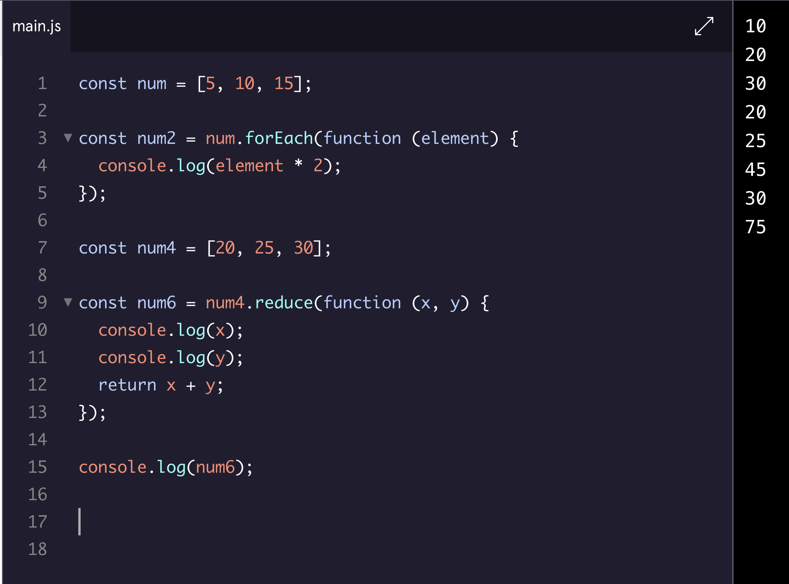

# This is: Javascript Notes

## Race Day

`let registeredEarly = prompt("Are you early?: ").toLocaleLowerCase === "yes";`

- If registeredEarly variable is equal to "yes", the comparison will evaluate to true (*truthy*) and the variable registeredEarly will be assigned the value of true. If the input is not "yes" the variable registeredEarly will be assigned the value of false (*falsey*). It's a one liner that check if the user is registered early or not by checking if the user input is 'yes' or not.

## Magic 8 Ball

`console.log(the magic 8 ball says: ${eightBallResponses[randomNumber]});`

- The `randomNumber` will dynaimcally return a correct number because of the (dot) length notation of eightBallResponses - this 'connects' a random number to our `eightBallResponses` array. 

## Higher Order Functions 

> `const checkConsistentOutput = (func, val) => {...}` In this code block 'func' and 'val' are "puched holes" NOT filled with real life values until plugging them in at `console.log(checkConsistentOutput(addTwo, 2));`

By thinking about functions as data, and learning about higher-order functions, you’ve taken important steps in learning to write clean, modular code that takes advantage of JavaScript’s flexibility.

Functions in JS are nothing more than another data type! - access properties and methods with DOT notation and reassign them to NEW variables.
- Abstraction allows us to write complicated code in a way that’s easy to reuse, debug, and understand for human readers.
  - Every company will have their own unique levels of abstractions - how do they bake a cake???
- Functions can be passed into other functions as parameters.
- A higher-order function is a function that either accepts functions as parameters, returns a function, or both.

## Iterators: Array Methods

> `.forEach()` always return undefined

`.forEach()` is used to execute the same code on every element in an array but does not change the array and returns undefined.

`.map()` executes the same code on every element in an array and returns a new array with the updated elements.

`.filter()` checks every element in an array to see if it meets certain criteria and returns a new array with the elements that return truthy for the criteria.

`.findIndex()` returns the index of the first element of an array that satisfies a condition in the callback function. It returns -1 if none of the elements in the array satisfies the condition.

`.reduce()` iterates through an array and takes the values of the elements and returns a single value.
All iterator methods take a callback function, which can be a pre-defined function, a function expression, or an arrow function.
